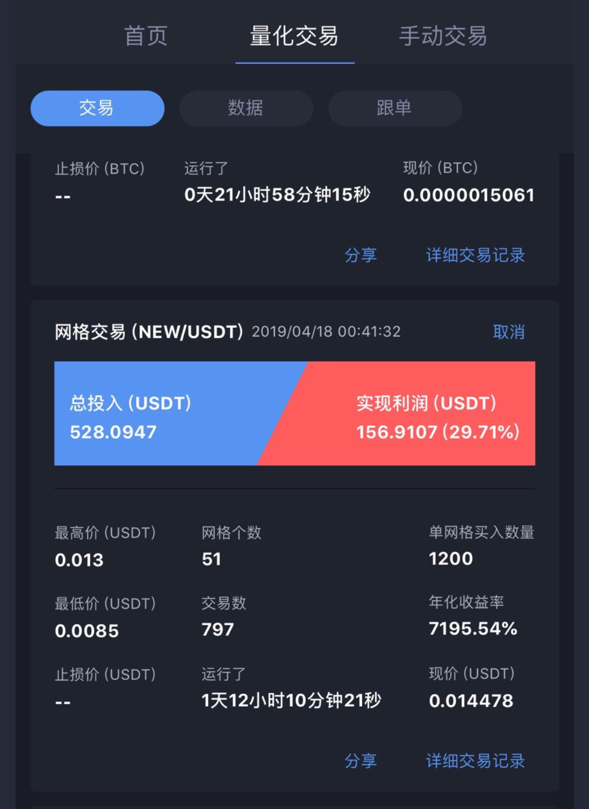
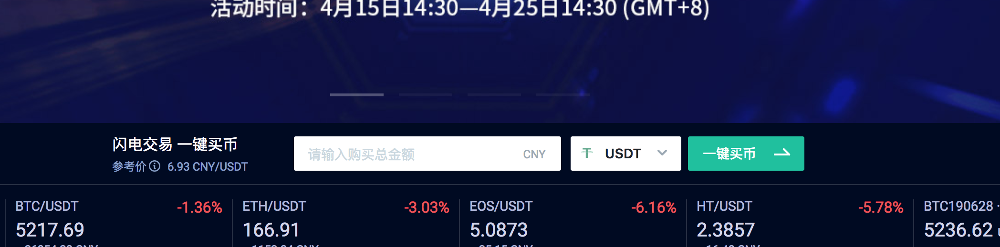
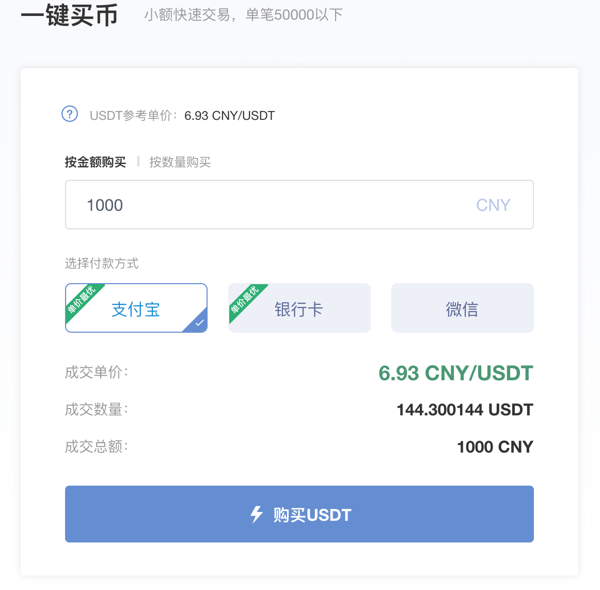

# 数字货币交易教程

### 数字货币交易时间

炒股的朋友知道A股的交易时间是非节假日的9:30 ～ 15:00，并且有涨停板限制。

数字货币的交易时间是7*24小时，就是说全年都可以交易，这对一些喜欢高频交易的朋友，是非常有乐趣，只要时间允许，就可以体验交易的刺激和乐趣。

### 那么什么是数字货币交易呢

可以把数字货币想象成人民币、欧元等现实货币（法币）。比如我只有100美元，当前汇率是6.7，那么我可以兑换670元人民币。当汇率下降到6的时候，我在把670元人民币换成美元，就变成了111美元。一倒手就挣了11美元。

但实际上法币的汇率变动不会特别剧烈，并且国内的资金监管还是很严的。

数字货币相对于法币来说，币种更多，货币的价格波动更加剧烈，目前的主流的数字货币有：BTC、ETH、EOS、BCH等。而且每天都会有新发的数字币，波动会更加剧烈些。下图是通过一个网格交易app交易的收益，可以看到收益是非常高的。

其中：USDT是稳定币，与美元等值；NEW是新发的数字币。在投入了**528 USDT**的本金后，运行大概22个小时，可以看到获得了接近**157 USDT**的收益，可以看出收益是非常惊人的。

**网格交易APP下载地址**：[BitUniverse](https://candy.biyou.tech/candy_bub/web/get_grid_diamond.html?invite_code=irycsmuN&from=account)

**但高收益同时伴随着高风险，入市要谨慎。**

### 那么将法币转化为数字币呢

相当于股市里的入金，目前网络上有很多支持法币和数字币交易的网站。有火币国际、localbitcoins等。

建议自己去网上多找些资料去多比较，选择一个口碑好的，便宜的平台。

我选择的是火币国际，主要因为两点。

* 傻瓜化，简单，方便。目前支持支付宝、微信、银行卡转账。(首页就有换币的入口，点击进去就可以交易了。注意单次超过2000人民币就要身份证验证了，主要为了防止洗黑钱等原因吧）

* 另外一个原因，由于我比较懒。简单对比了下其他的平台，相对来说法币兑换数字币还是比较合适的。转账后，基本几分钟就可以收到对应的数字币，简单好用，还是不错的。

建议选择兑换USDT，比较稳定，跟美元等值，波动小。

**火币国际法币兑换平台**：[火币国际](https://www.huobi.co/zh-cn/topic/invited/?invite_code=zzkd4)

*注意：因为火币平台比较大，山寨的比较多，如果自己搜索的话，可以与我给出的链接对比下，以免上当受骗。*

### 我有数字币了，那么我如何币币交易呢？

再来说下数字货币，数字货币就是一堆通过计算机程序展现的数字。

那么我如何保存我的数字币呢？其实是通过特定的工具（交易所或数字钱包）给每个人生成一个类似于门牌号一样的一串编码，在这串编码里对应的记录了多少数字，就代表你有多少币。

回到上文，我以火币国际为例说明，当你兑换完了数字币后，还不能交易，需要在 *我的资产* 中 *划转提现* 到 币币账户才能交易或转到其他的交易所。

交易所就是撮合不同币种间交易的一个平台。比较出名的有币安、火币、OKEX和FCoin等，有的需要 翻*墙，对比下找个费率低的，出名的就好。

我主要使用了以下三个：

####[币安](https://www.binance.com/?ref=36684733)

* 在国内口碑算比较好的

* 手续费0.1%，持有BNB手续费7.5折，折后手续费 0.075%

####[火币国际](https://www.huobi.co/zh-cn/topic/invited/?invite_code=zzkd4)

* 新币种较多，波动大

* 正常手续费0.2%，可以使用火币点卡抵扣手续费，大概能到折后 0.1%以下（在官网买较贵，可以找场外的点卡商人购买，大概能几折买到，找不到的可以联系我）

####[FCoin](https://www.fcoin.com/)

* 会返回部分手续费，主板基本都是主流币。

* 主板A: Taker（主动吃单）支付0.05%手续费，Maker（挂单被动成交）赚取0.05%手续费。  主板B: Taker（主动吃单）支付0.1%手续费，Maker（挂单被动成交）赚取0.075%手续费。 

  创新板: Taker（主动吃单）支付0.2%手续费，Maker（挂单被动成交）赚取0.15%手续费。

### 最终如何获得高额收益呢

目前主要依靠低买高卖的策略，即网格交易（量化交易）。比如当前比特币价格为1元，我分别挂了0.6，0.8单买入，然后挂了1.2， 1.4的价格卖出，赚取波动的收益。所以数字币的波动越高，收益越大。

目前使用的是：[BitUniverse](https://candy.biyou.tech/candy_bub/web/get_grid_diamond.html?invite_code=irycsmuN&from=account) + [火币国际](https://www.huobi.co/zh-cn/topic/invited/?invite_code=zzkd4) +[币安](https://www.binance.com/?ref=36684733)

其实就是通过程序自动调用交易所提供的api，进行量化操作，目前[BitUniverse](https://candy.biyou.tech/candy_bub/web/get_grid_diamond.html?invite_code=irycsmuN&from=account) 免费，可以参考下。

